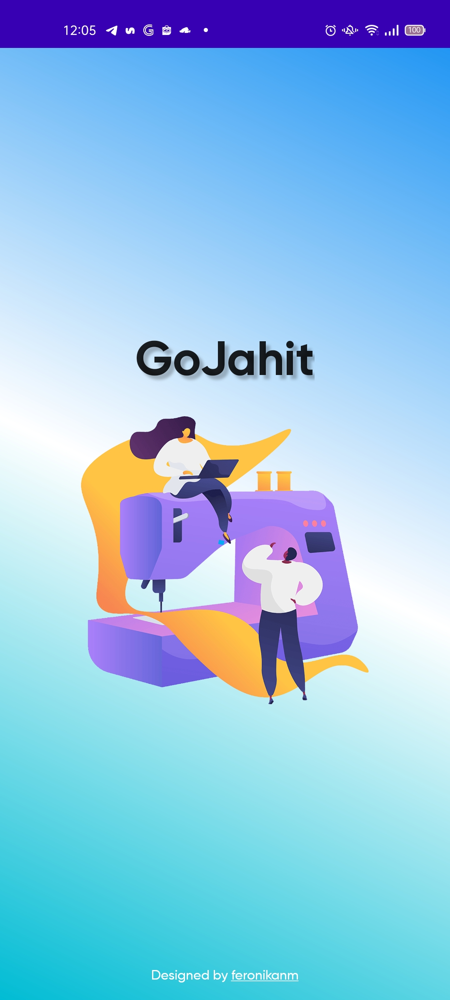
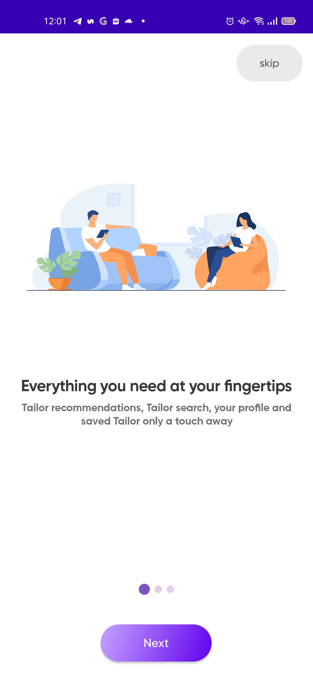
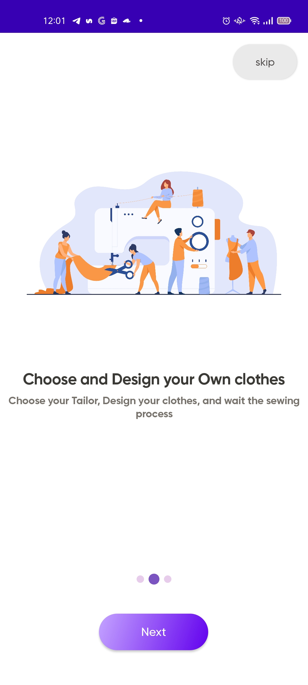
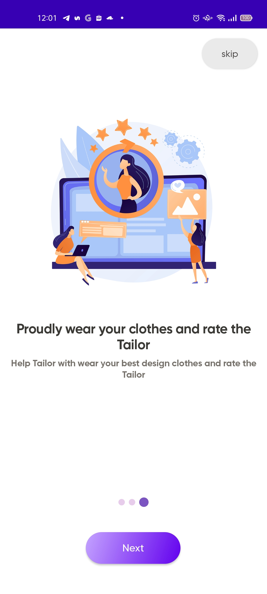
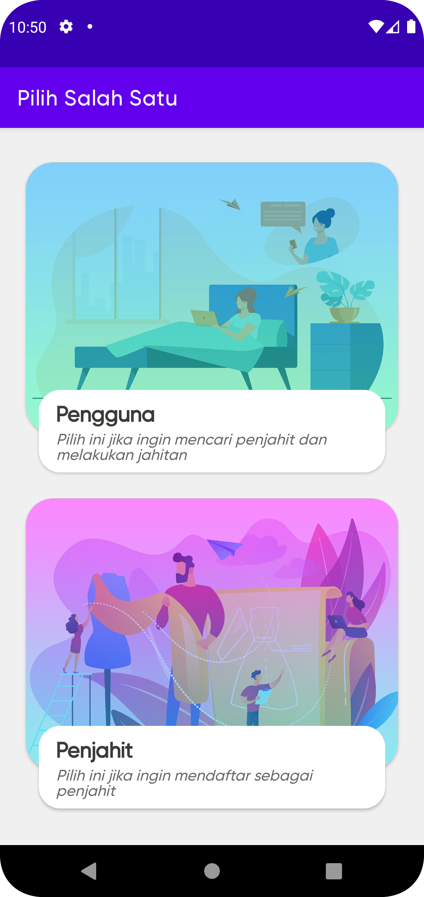
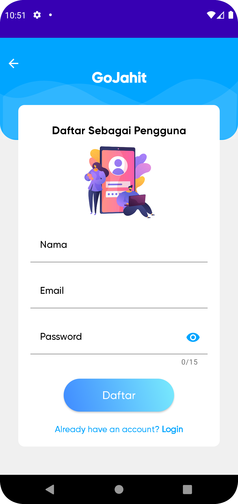
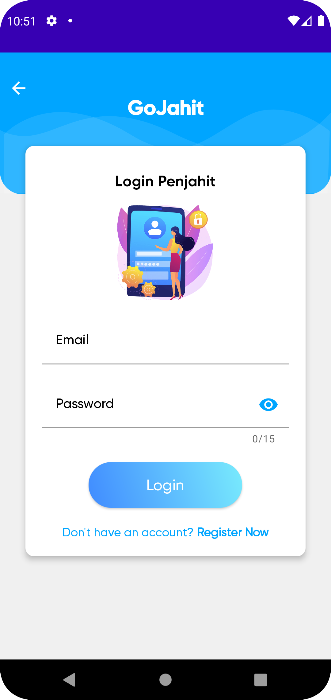
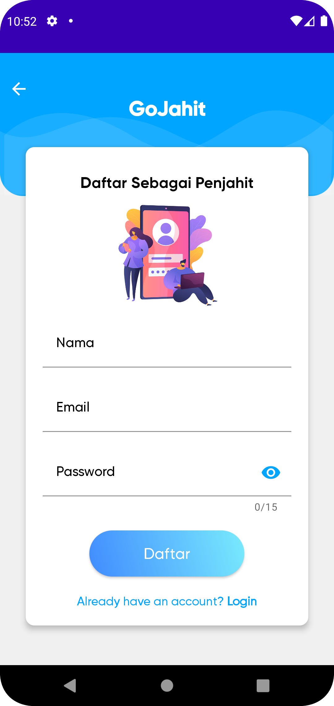

## GoJahit Client - Aplikasi Pencari Penjahit

## About This Project
Aplikasi Pencari Penjahit Berbasis Android Menggunakan Teknologi Location Based Services dan Metode SMART. Teknologi Location Based Services (LBS) digunakan untuk penentuan lokasi, sedangkan metode SMART digunakan untuk perangkingan penjahit.

Dalam menentukan kriteria, saya menggunakan data dari penelitian sebelumnya milik sdr Susandri dan rekan-rekannya pada tahun 2020 mengenai Aplikasi Jasa Jahit Pakaian Berbasis Mobile dengan Teknologi Location Based Services dan Metode SMART dalam menentukan kriteria yang dibutuhkan untuk diimplementasikan ke dalam sistem.
Berikut kriteria yang dipilih:
1. Kriteria kualitas pekerjaan.
   Pada kriteria kualitas pekerjaan diambil berdasarkan penilaian mengenai kepuasan hasil jahitan yang dilakukan oleh penjahit.
2. Kriteria lama waktu pengerjaan.
   Pada kriteria lama waktu pengerjaan diambil berdasarkan penilaian kecepatan dan ketepatan waktu penjahit dalam menyelesaikan jahitan.
3. Kriteria layanan penjahit.
   Pada kriteria layanan penjahit diambil berdasarkan penilaian mengenai keramahan dan respon penjahit pada saat terjadinya pemesanan hingga jahitan selesai.
4. Kriteria harga jasa jahit.
   Pada kriteria layanan penjahit diambil berdasarkan penilaian mengenai kecocokan harga dengan hasil yang diberikan. 
   
Dalam menentukan bobot kriteria dan parameter untuk setiap kriteria dengan memberikan bobot kriteria pada masing-masing kriteria dengan menggunakan interval 1-100 untuk masing-masing kriteria dengan prioritas terpenting. 
Setiap kriteria dibagi dalam tiga parameter yang berbeda, diantaranya yaitu:
1. Kualitas Pekerjaan : 1 buruk, 2 cukup, 3 baik.
2. Lama Waktu Pengerjaan : 1 tidak tepat, 2 tepat waktu, 3 lebih awal.
3. Layanan Penjahit : 1 tidak suka, 2 suka, 3 sangat suka.
4. Harga Jasa Jahit : 1 tinggi, 2 sedang, 3 rendah.

## Final Task (Skipsi)

- Download the application [here](https://drive.google.com/drive/folders/1bp0LWzJ0XXViDGqM-BnUzkKF_stwFPIi). 
- Watch the demo video of the application [here](https://drive.google.com/drive/u/4/my-drive).

## Informatics Lecturers

- Retno Mumpuni, S.Kom, M.Sc. (NPT. 172198 70 716054) - retnomumpuni.if@upnjatim.ac.id
- Hendra Maulana, S.Kom, M.Kom. (NPT. 201198 31 223248)- hendra.maulana.if@upnjatim.ac.id

## Architecture
-   Pattern  [Model-View-ViewModel](https://en.wikipedia.org/wiki/Model%E2%80%93view%E2%80%93viewmodel)  (MVVM) facilitating a [separation](https://en.wikipedia.org/wiki/Separation_of_concerns) of development of the graphical user interface.

## Version Release
This Is Latest Release

    ~ Beta Release
    $version_release = 1.0.0

## Diagram

## Screenshot Application

| Splash Screen | Landing Page (1) | Landing Page (2) | Landing Page (3) |
|:-------------:|:----------------:|:----------------:|:----------------:|
| |  |  |  |

| Memilih User | Login Pengguna | Register Pengguna | Login Penjahit |  Register Penjahit |
|:------------:|:--------------:|:-----------------:|:--------------:|:------------------:|
| |  |  |  |  |

## Colaborator
Very open to anyone, I'll write your name under this, please contribute by sending an email to me

- Mail to feronikanm@gmail.com
- Subject : Github _ [Github-Username-Account] _ [Language] _ [Repository-Name]
- Example : Github_feronikanm_kotlin_gojahit_client

Name of Contributor
- Feronika Nur Maghfiro
- Muhammad Faisal Amir - [Github](https://github.com/amirisback/)
- Waiting List

Waiting for your contribution

## Adding Information

- Please enjoy and you can fork or give a star for this project
- Free to follow my github account feronikanm
- Hope this project can help, thankyou for the support

## MAD Scorecard Result

